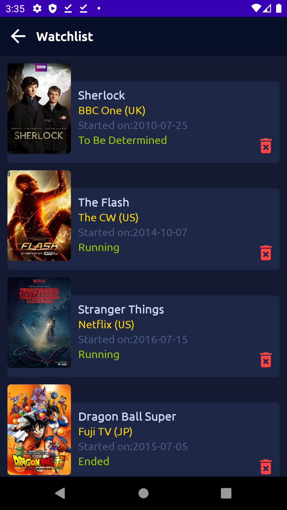

# Practices_Android_ChiragKachhadiya_MvvvmTvShows
Practices：ChiragKachhadiya_MvvmTvShows

***
#### 項目 ####

ChiragKachhadiya MvvmTvShows
---

***
#### 簡介 ####

本專案為「[Chirag Kachhadiya](https://www.youtube.com/channel/UCmL5TAblHHgh1xhabmPjYgw)」分享於「Youtube」平台。

- [Android MVVM | TV Shows App | Tutorial #1 | Project Setup, APIs Intro & Primary Layout Design](https://www.youtube.com/watch?v=-Ue9Ayv4_kY&list=PLam6bY5NszYOUDKwe-6tVhb3zVevwbHiK)
- [Android MVVM | TV Shows App | Tutorial #2 | Setup Retrofit & TV Shows API Integration](https://www.youtube.com/watch?v=kIWAJxY4xss&list=PLam6bY5NszYOUDKwe-6tVhb3zVevwbHiK&index=2)
- [Android MVVM | TV Shows App | Tutorial #3 | Displaying TV Shows Using RecyclerView With Data Binding](https://www.youtube.com/watch?v=hEcma_uOZ7Y&list=PLam6bY5NszYOUDKwe-6tVhb3zVevwbHiK&index=3)
- [Android MVVM | TV Shows App | Tutorial #4 | Pagination In TV Show List | Endless Recycler View](https://www.youtube.com/watch?v=Pe0sq-hu-P4&list=PLam6bY5NszYOUDKwe-6tVhb3zVevwbHiK&index=4)
- [Android MVVM | TV Shows App | Tutorial #5 | TV Show Details API Integration](https://www.youtube.com/watch?v=rEOVNid8_Nc&list=PLam6bY5NszYOUDKwe-6tVhb3zVevwbHiK&index=5)
- [Android MVVM | TV Shows App | Tutorial #6 | Displaying Image Slider Using ViewPager2 & Data Binding](https://www.youtube.com/watch?v=6TIByFLkI-8&list=PLam6bY5NszYOUDKwe-6tVhb3zVevwbHiK&index=6)
- [Android MVVM | TV Shows App | Tutorial #7 | TV Show Details Screen](https://www.youtube.com/watch?v=vEiC0YgP-xA&list=PLam6bY5NszYOUDKwe-6tVhb3zVevwbHiK&index=7)
- [Android MVVM | TV Shows App | Tutorial #8 | Displaying Episodes | Bottom Sheet Dialog](https://www.youtube.com/watch?v=MQhE4Vk2_L0&list=PLam6bY5NszYOUDKwe-6tVhb3zVevwbHiK&index=8)
- [Android MVVM | TV Shows App | Tutorial #9 | Room - Database Setup | Creating Watchlist](https://www.youtube.com/watch?v=rTjyOQrKZU0&list=PLam6bY5NszYOUDKwe-6tVhb3zVevwbHiK&index=9)
- [Android MVVM | TV Shows App | Tutorial #10 | The Watchlist - Room Persistence Library | Part 1/2](https://www.youtube.com/watch?v=eTXDvEZ7_T0&list=PLam6bY5NszYOUDKwe-6tVhb3zVevwbHiK&index=10)
- [Android MVVM | TV Shows App | Tutorial #11 | The Watchlist - Room Persistence Library | Part 2/2](https://www.youtube.com/watch?v=EfAcki-5ti0&list=PLam6bY5NszYOUDKwe-6tVhb3zVevwbHiK&index=11)
- [Android MVVM | TV Shows App | Tutorial #12 | Search TV Show API Integration](https://www.youtube.com/watch?v=ZPN4nn_xOpM&list=PLam6bY5NszYOUDKwe-6tVhb3zVevwbHiK&index=12)

<br>

```
Practiecs! Without unceasing practice nothing can be done.
```

<br>

#### 預覽圖 ####



